> [!NOTE]
> This repo is a rewrite of [Town of Us Reactivated](https://github.com/eDonnes124/Town-Of-Us-R) and is under constant development, expect bugs.\
> This mod is NOT for console versions of Among Us and is NOT host only either, please do not ask for a port or a rewrite.

-----------------------

  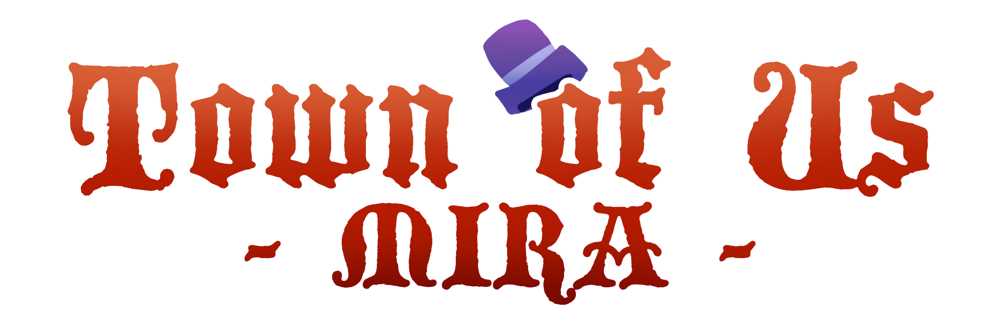
  
Town Of Us Mira

  
  
  
  

 

An [Among Us](https://store.steampowered.com/app/945360/Among_Us) mod based on Town of Salem, designed to be a rewrite of Town of Us Reactivated!

-----------------------

# Key Differences with TOU Mira

- Revamped visuals
- New roles such as Ambassador, Ambusher, Inquisitor, Mirrorcaster
- New modifiers such as Circumvent, Scout, Telepath, Operative
- Localization to numerous languages (being worked on still)
- Vanilla role support (allowing players to use vanilla roles alongside modded roles)
- Balance changes into the mix for players to use
- Compatibility with a handful of other role mods that run on MiraAPI.

-----------------------

> [!TIP]
> Join the Reactivated [Discord](https://discord.gg/ugyc4EVUYZ) if you have any problems or want to find people to play with!\
> Check out the mod's [wiki](https://au-avengers.github.io/docs.toum.gg) for info!

-----------------------

# Contents

- [**Contents**](#contents)
- [**Releases**](#releases)
- [**Changelogs**](https://au-avengers.github.io/docs.toum.gg/blog)
- [**Installation**](https://au-avengers.github.io/docs.toum.gg/docs/install/intro)
  - [Windows Guides (Epic, Itch, MS Store, Steam)](https://au-avengers.github.io/docs.toum.gg/docs/category/windows-install)
  - [Linux Guides (Epic, Itch, Steam)](https://au-avengers.github.io/docs.toum.gg/docs/category/linux--steam-deck-install)
- [**Mod Info**](https://au-avengers.github.io/docs.toum.gg/)
- [**Credits & Resources**](https://github.com/AU-Avengers/TOU-Mira/wiki/Credits)
- [**License**](#license)
- [**Copyright**](#copyright)

-----------------------

  
  <a href="https://au-avengers.github.io/docs.toum.gg/docs/roles/crewmate/investigative/Aurial">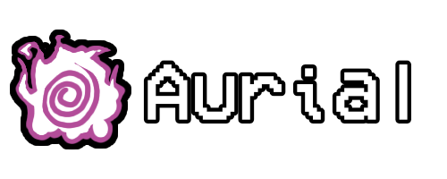</a>
  <a href="https://au-avengers.github.io/docs.toum.gg/docs/roles/crewmate/investigative/Detective">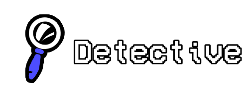</a> 
  <a href="https://au-avengers.github.io/docs.toum.gg/docs/roles/crewmate/investigative/Haunter">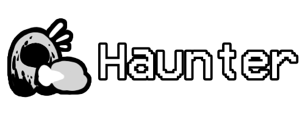</a>
  <a href="https://au-avengers.github.io/docs.toum.gg/docs/roles/crewmate/investigative/Investigator">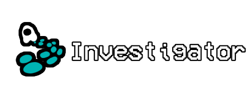</a> 
  <a href="https://au-avengers.github.io/docs.toum.gg/docs/roles/crewmate/investigative/Lookout">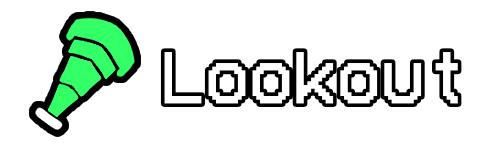</a> 
  <a href="https://au-avengers.github.io/docs.toum.gg/docs/roles/crewmate/investigative/Mystic">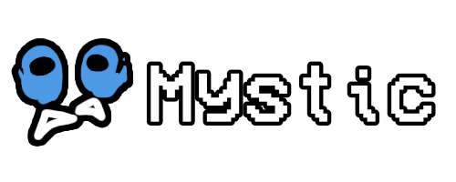</a> 
  <a href="https://au-avengers.github.io/docs.toum.gg/docs/roles/crewmate/investigative/Seer">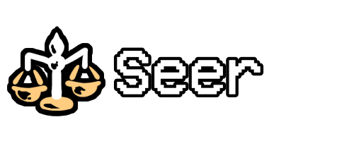</a> 
  <a href="https://au-avengers.github.io/docs.toum.gg/docs/roles/crewmate/investigative/Snitch">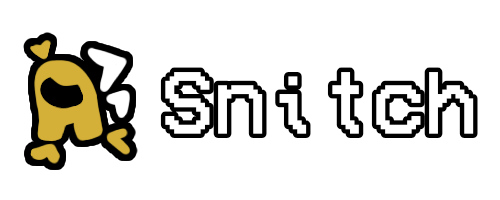</a>
  <a href="https://au-avengers.github.io/docs.toum.gg/docs/roles/crewmate/investigative/Spy">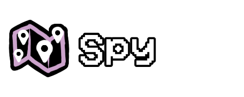</a>
  <a href="https://au-avengers.github.io/docs.toum.gg/docs/roles/crewmate/investigative/Tracker">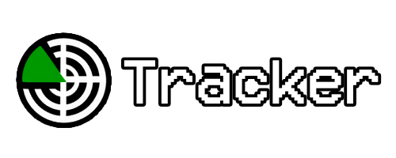</a>
  <a href="https://au-avengers.github.io/docs.toum.gg/docs/roles/crewmate/investigative/Trapper">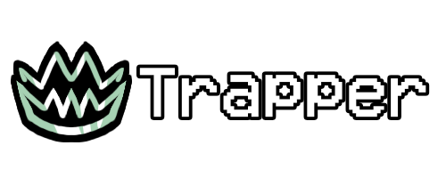</a>
  
  
  <a href="https://au-avengers.github.io/docs.toum.gg/docs/roles/crewmate/killing/Hunter">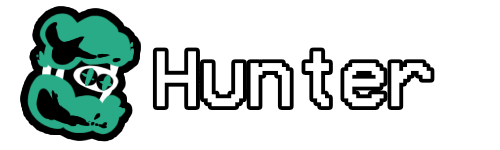</a>
  <a href="https://au-avengers.github.io/docs.toum.gg/docs/roles/crewmate/killing/Sheriff">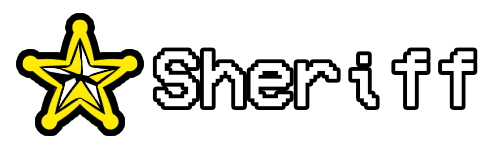</a>
  <a href="https://au-avengers.github.io/docs.toum.gg/docs/roles/crewmate/killing/Veteran">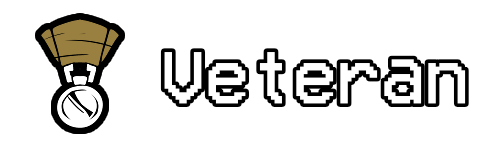</a>
  <a href="https://au-avengers.github.io/docs.toum.gg/docs/roles/crewmate/killing/Vigilante">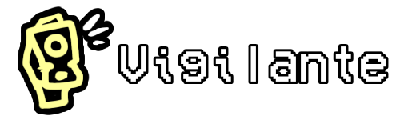</a>
  
  <a href="https://au-avengers.github.io/docs.toum.gg/docs/roles/crewmate/power/Jailor">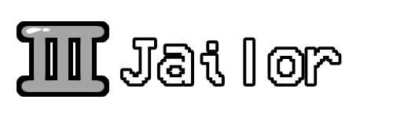</a>
  <a href="https://au-avengers.github.io/docs.toum.gg/docs/roles/crewmate/power/Mayor">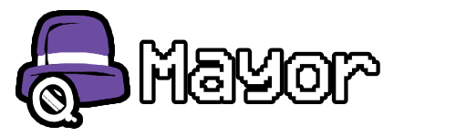</a>
  <a href="https://au-avengers.github.io/docs.toum.gg/docs/roles/crewmate/power/Politician">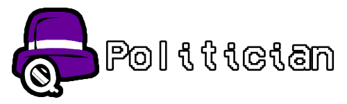</a>
  <a href="https://au-avengers.github.io/docs.toum.gg/docs/roles/crewmate/power/Prosecutor">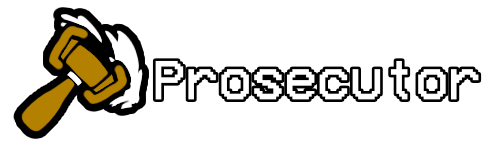</a>
  <a href="https://au-avengers.github.io/docs.toum.gg/docs/roles/crewmate/power/Swapper">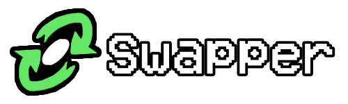</a>
  
  <a href="https://au-avengers.github.io/docs.toum.gg/docs/roles/crewmate/protective/Altruist">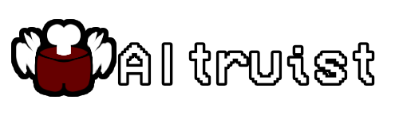</a>
  <a href="https://au-avengers.github.io/docs.toum.gg/docs/roles/crewmate/protective/Cleric">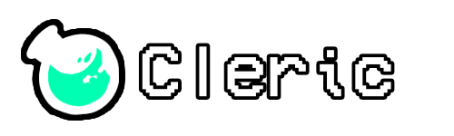</a>
  <a href="https://au-avengers.github.io/docs.toum.gg/docs/roles/crewmate/protective/Medic">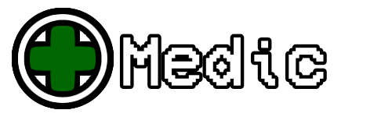</a>
  
  <a href="https://au-avengers.github.io/docs.toum.gg/docs/roles/crewmate/protective/Warden">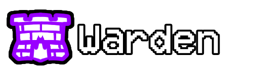</a>
  
  <a href="https://au-avengers.github.io/docs.toum.gg/docs/roles/crewmate/support/Engineer">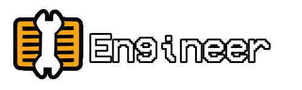</a>
  <a href="https://au-avengers.github.io/docs.toum.gg/docs/roles/crewmate/support/Imitator">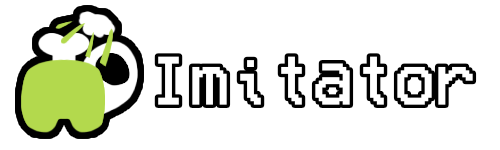</a>
  <a href="https://au-avengers.github.io/docs.toum.gg/docs/roles/crewmate/support/Medium">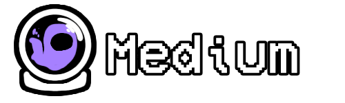</a>
  <a href="https://au-avengers.github.io/docs.toum.gg/docs/roles/crewmate/support/Plumber">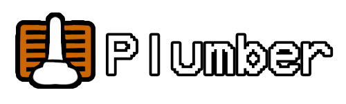</a>
  <a href="https://au-avengers.github.io/docs.toum.gg/docs/roles/crewmate/support/Transporter">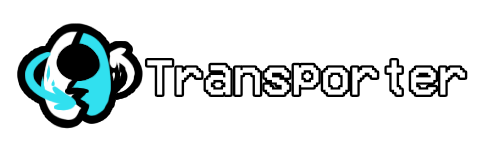</a>
  
  <a href="https://au-avengers.github.io/docs.toum.gg/docs/roles/impostor/concealing/Eclipsal">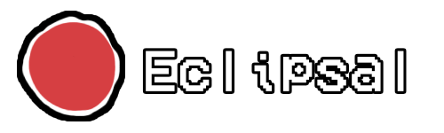</a>
  
  <a href="https://au-avengers.github.io/docs.toum.gg/docs/roles/impostor/concealing/Grenadier">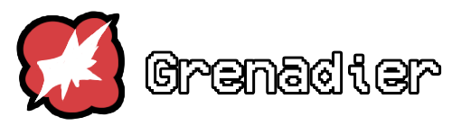</a>
  
  <a href="https://au-avengers.github.io/docs.toum.gg/docs/roles/impostor/concealing/Swooper">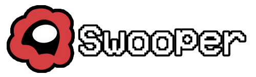</a>
  <a href="https://au-avengers.github.io/docs.toum.gg/docs/roles/impostor/concealing/Venerer">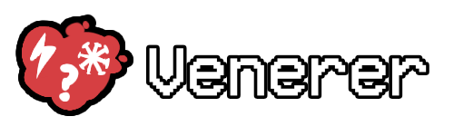</a>
  
  <a href="https://au-avengers.github.io/docs.toum.gg/docs/roles/impostor/killing/Bomber">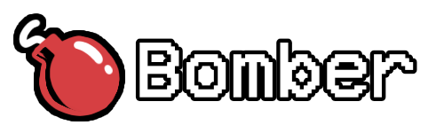</a>
  <a href="https://au-avengers.github.io/docs.toum.gg/docs/roles/impostor/killing/Scavenger">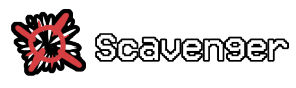</a>
  
  <a href="https://au-avengers.github.io/docs.toum.gg/docs/roles/impostor/killing/Warlock">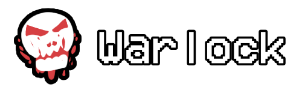</a>
  
  
  
  <a href="https://au-avengers.github.io/docs.toum.gg/docs/roles/impostor/support/Janitor">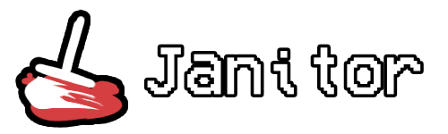</a>
  <a href="https://au-avengers.github.io/docs.toum.gg/docs/roles/impostor/support/Miner">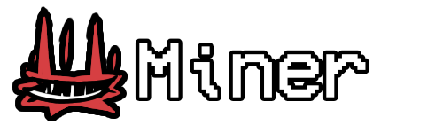</a>
  
  
  <a href="https://au-avengers.github.io/docs.toum.gg/docs/roles/neutral/benign/Amnesiac">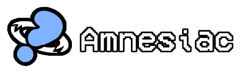</a>
  <a href="https://au-avengers.github.io/docs.toum.gg/docs/roles/neutral/benign/Guardian%20Angel">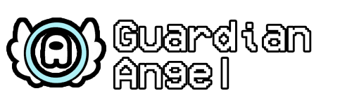</a>
  
  <a href="https://au-avengers.github.io/docs.toum.gg/docs/roles/neutral/benign/Survivor">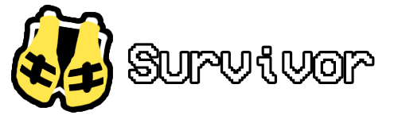</a>
  
  <a href="https://au-avengers.github.io/docs.toum.gg/docs/roles/neutral/evil/Doomsayer">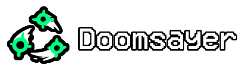</a>
  <a href="https://au-avengers.github.io/docs.toum.gg/docs/roles/neutral/evil/Executioner">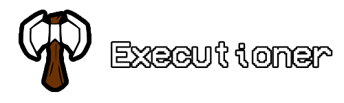</a>
  
  <a href="https://au-avengers.github.io/docs.toum.gg/docs/roles/neutral/evil/Jester">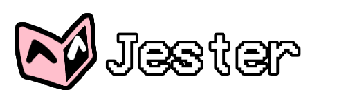</a>
  <a href="https://au-avengers.github.io/docs.toum.gg/docs/roles/neutral/evil/Phantom">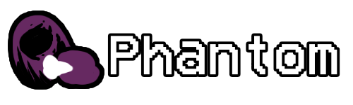</a>
  
  
  <a href="https://au-avengers.github.io/docs.toum.gg/docs/roles/neutral/killing/Glitch">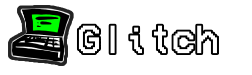</a>
  <a href="https://au-avengers.github.io/docs.toum.gg/docs/roles/neutral/killing/Juggernaut">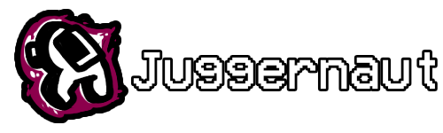</a>
  <a href="https://au-avengers.github.io/docs.toum.gg/docs/roles/neutral/killing/Plaguebearer">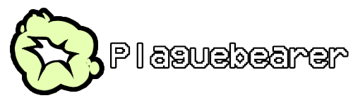</a>
  
  <a href="https://au-avengers.github.io/docs.toum.gg/docs/roles/neutral/killing/Soul%20Collector">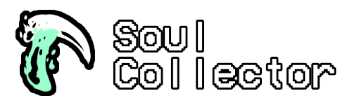</a>
  
  
  
  
  
    
    
   
  
    
  
  
    
    
    
   

-----------------------

# Releases

**Disclaimer: The mod is *not* guaranteed to work on the latest versions of Among Us when the game updates.**

| Among Us   | Mod Version | Download Link                                                           |
|------------|-------------|-------------------------------------------------------------------------|
| 2025.10.28 | 1.5.3       | [Download](https://github.com/AU-Avengers/TOU-Mira/releases/tag/1.5.3)  |
| 2025.10.28 | 1.5.2       | [Download](https://github.com/AU-Avengers/TOU-Mira/releases/tag/1.5.2)  |
| 2025.10.28 | 1.5.1       | [Download](https://github.com/AU-Avengers/TOU-Mira/releases/tag/1.5.1)  |
| 2025.10.28 | 1.5.0       | [Download](https://github.com/AU-Avengers/TOU-Mira/releases/tag/1.5.0)  |
| 2025.10.28 | 1.4.1       | [Download](https://github.com/AU-Avengers/TOU-Mira/releases/tag/1.4.1)  |
| 2025.10.28 | 1.4.0       | [Download](https://github.com/AU-Avengers/TOU-Mira/releases/tag/v1.4.0) |
| 2025.10.14 | 1.3.1       | [Download](https://github.com/AU-Avengers/TOU-Mira/releases/tag/v1.3.1) |
| 2025.9.9   | 1.3.0       | [Download](https://github.com/AU-Avengers/TOU-Mira/releases/tag/v1.3.0) |
| 2025.9.9   | 1.2.1       | [Download](https://github.com/AU-Avengers/TOU-Mira/releases/tag/v1.2.1) |
| 2025.9.9   | 1.2.0       | [Download](https://github.com/AU-Avengers/TOU-Mira/releases/tag/v1.2.0) |
| 2025.5.20  | 1.1.1       | [Download](https://github.com/AU-Avengers/TOU-Mira/releases/tag/v1.1.1) |
| 2025.5.20  | 1.1.0       | [Download](https://github.com/AU-Avengers/TOU-Mira/releases/tag/v1.1.0) |
| 2025.5.20  | 1.0.5       | [Download](https://github.com/AU-Avengers/TOU-Mira/releases/tag/v1.0.5) |
| 2025.5.20  | 1.0.2       | [Download](https://github.com/AU-Avengers/TOU-Mira/releases/tag/v1.0.2) |
| 2025.5.20  | 1.0.1       | [Download](https://github.com/AU-Avengers/TOU-Mira/releases/tag/v1.0.1) |
| 2025.5.20  | 1.0.0       | [Download](https://github.com/AU-Avengers/TOU-Mira/releases/tag/v1.0.0) |

-----------------------

# Actively Supported Languages

All languages are added via our [Weblate](https://weblate.duikbo.at/projects/town-of-us-mira/) instance. If you want to contribute to the project please let us know in the discord server!

|       Language        |                                                                                Overall Progress                                                                                 |
|:---------------------:|:-------------------------------------------------------------------------------------------------------------------------------------------------------------------------------:|
|     All Languages     |            |
|  Simplified Chinese   |  |
|  Traditional Chinese  |  |
|         Dutch         |       |
|       Filipino        |   |
|        French         |       |
|        German         |       |
|         Irish         |       |
|        Italian        |       |
|       Japanese        |       |
|        Korean         |       |
|      Lithuanian       |       |
|        Polish         |       |
|  Portuguese (Brazil)  |    |
| Portuguese (Portugal) |    |
|        Russian        |       |
|        Spanish        |       |
|    Spanish (LATIM)    |   |
|        Swedish        |       |
|        Turkish        |       |

-----------------------

# Contributions & Credits

> [!NOTE]
> If you wish to make an Extension Mod that builds on top of TOU Mira, you may look at [MiraAPI](https://github.com/All-Of-Us-Mods/MiraAPI)'s Example Mod or the official [Example Mod](https://github.com/AU-Avengers/TouExtensionExample).

-----------------------

# Mod Compatibility

**Disclaimer: This mod compatibility list can and will change over time.**

If a mod is missing here and is a role/modifiers mod, it likely won't work unless it is built with [MiraAPI](https://github.com/All-Of-Us-Mods/MiraAPI)!

|                                    Mod                                    | Support | Notes                                                                                                                                             |
|:-------------------------------------------------------------------------:|:-------:|:--------------------------------------------------------------------------------------------------------------------------------------------------|
|        [Submerged](https://github.com/SubmergedAmongUs/Submerged)         | ✅ | Custom Door Types cannot be adjusted fully.                                                                                                       |
|       [Level Impostor](https://github.com/DigiWorm0/LevelImposter)        | ✅ | Custom Door Types cannot be changed.                                                                                                              |
|             [NewMod](https://github.com/CallOfCreator/NewMod)             | ✅ | Runs fine, but NewMod role icons are missing. Wiki is not fully implemented.                                                                  |
| [Launchpad Reloaded](https://github.com/All-Of-Us-Mods/LaunchpadReloaded) | ✅ | Launchpad tags overlap with Tou player names. Wiki is not fully implemented.                                                                  |
|     [Reach for Stars](https://pixmakesgames.itch.io/reach-for-stars)      | ⚠️ | Ability buttons are very seperated from one another. Roles are partially broken on latest Among Us update. Wiki is not fully implemented. |

The mods below are designed to fully work with TOU Mira, often adding new roles and modifiers!

|                              Extension Mod                              |     Mod Type      | Description                                                                                                                                                                           |
|:-----------------------------------------------------------------------:|:-----------------:|:--------------------------------------------------------------------------------------------------------------------------------------------------------------------------------------|
|         [ChaosTokens](https://github.com/xChipseq/ChaosTokens)          |   Game Feature    | A mod that adds gambling to TOU! Each round, players can get one, two, or no tokens, which enhances the chaos in the game. Each roll may give a positive, negative, or benign effect. |
| [Roles Extension](https://github.com/rewalo/TownOfUsMiraRolesExtension) | Roles / Modifiers | A mod that adds new roles and modifiers, including a replacement of TOU Trapper.                                                                                                      |
|           [AUSummary](https://github.com/notnico22/AUSummary)           |   Miscellaneous   | A client-side mod that directly connects with a custom application to display your previous matches.                                                                                  |
|    [TOU Mira: Legacy](https://github.com/AU-Avengers/TouMiraLegacy)     |     UI Tweaks     | A client-side mod that replaces the assets of Among Us and TOU Mira to that of pre-2021 AU and TOU/TOUR.                                                                              |

-----------------------

# License
This software is distributed under the GNU GPLv3 License. BepInEx is distributed under the LGPL-2.1 License.

# Copyright

This mod is not affiliated with Among Us or Innersloth LLC, and the content contained therein is not endorsed or otherwise sponsored by Innersloth LLC. Portions of the materials contained herein are property of Innersloth LLC.

© Innersloth LLC.

